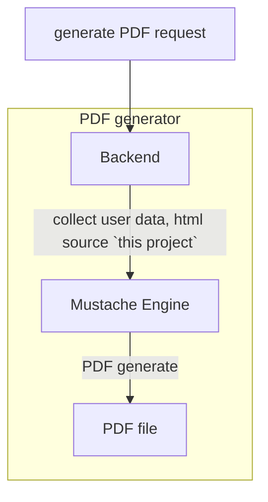

# Project overview

In this project, there are HTML templates source for PDF generator.

This source is connected to PHP backend using Mustache template engine a dynamic pages.



## File desciption

- cash.html
cash form

- margin.html
margin form

## Dynamic variables

Variables value will be assigned by backend Musache template engine.

### Checkboxes

```html
<input type="checkbox" id="No3" class="{{account_info.structured_product_experience_id_no_checkbox_class}}" />
```

if the checkbox is checked, the class will be assigned value as `checkbox-checked`, see below example:

```html
<input type="checkbox" id="No3" class="checkbox-checked" />
```

if the checkbox is not checked, the class will be assigned value `_not_checked` as below example

```html
<input type="checkbox" id="No3" class="_not_checked" />
```

### Input fields

Similarly, form fields usage is as below

```html
<strong>  {{account_info.firstname_zh}} {{account_info.lastname_zh}}</strong>
```

variable will be assigned

```html
<strong> John Deo</strong>
```

## styling
common style should be centrailse to `style.css`, or inline for simple style

> **IMOPRTANT**

only `css/style.css` and specific html files are configured as extenal source, adding else files will break the program.